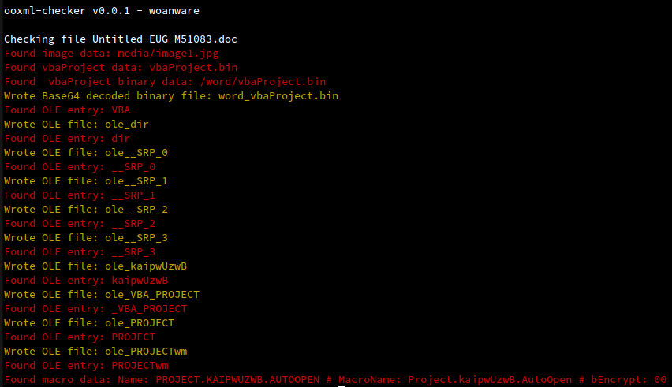

# ooxml-checker

Console application to perform checks against modern Office documents in XML format (ooxml). 

## Running

Some malware use a single XML document that holds all of the Office component files. If this is the case then run with the **-n** flag (No unzip)

```
./ooxml-checker -i Untitled-EUG-M51083.doc -o . -n
```

```
./ooxml-checker -i Doc1.docx -o .
```

When processing a standard Office document, a folder is created with the specified output folder. The documents file name (no ext) is used as the new folder name

## Processing

If binary data or VBA projects are encountered, the data is Base64 decoded and written to it's own file if required. Both binary and VBA project data is parsed using an OLE parser and any items identified are written to separate files, using the OLD item name as the file name

## Checks

- Images
- Audio
- Hyperlinks
- VBA
- Binary Data
- Macro
- DDE

## Screenshot

The screenshot below shows the output when running against an Emotet infected Word document.

